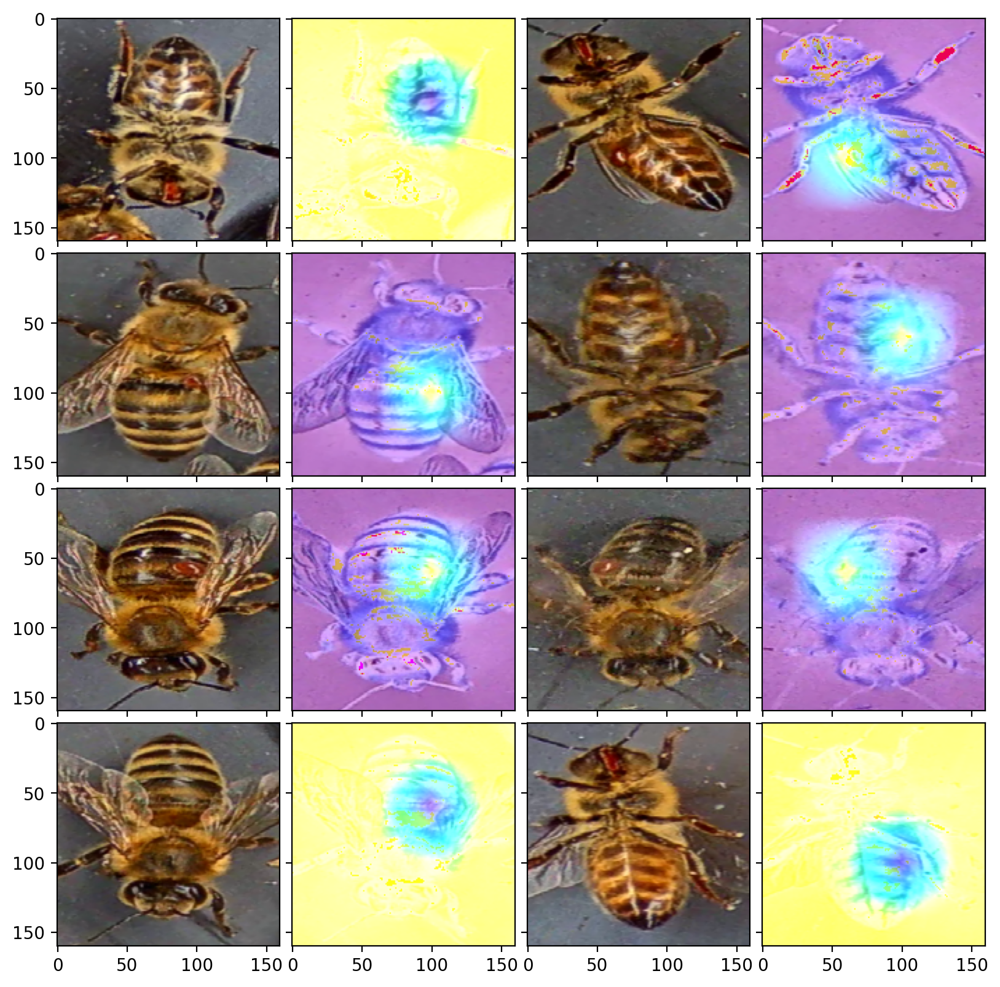

# varroa-detect

Classifiers for detection of bees infected by varroa mites. Each model is available as a quantized TFLite classifier for inference with mobile devices and as a classifier compiled for the Coral Edge TPU.

<div align="center">
  
</div>

## Performance

Prediction scores and inference speeds are documented in ```results/report/report.pdf```.

## Usage

### Edge TPU

The easiest and most performant way to make inferences is to use the quantized models compiled for the [Coral Edge TPU](https://coral.ai/products/) with the ```edgetpu``` Python API. It can be installed with ```scripts/install_edgetpu_api.sh``` and requires a detected Edge TPU device (for example the [USB Accelerator](https://coral.ai/products/accelerator/) or the [Dev Board](https://coral.ai/products/dev-board/)). If a TFLite model which is not fully compiled for the Edge TPU is passed to the ```ClassificationEngine```, then uncompiled parts of the computation are executed by the CPU.

Here is an example for how to use the API for single label classification.

```python
import numpy as np
from PIL import Image

from edgetpu.classification.engine import ClassificationEngine

# Load model (Edge TPU is automatically used if possible)
classifier = ClassificationEngine('models/160_160_3_mobilenetv2/model_edgetpu.tflite')
# Input dimensions do not have to match (resize is done by classify_with_image)
input_data = np.array(np.random.random_sample((280, 160, 3)), dtype=np.uint8)
# Accepts PIL image
image = Image.fromarray(input_data, 'RGB')
# Set threshold to smaller than 0 to not omit any predictions
# Predictions are returned as [(label_id, confidence_score)]
prediction[0][1] = classifier.classify_with_image(image, threshold=-1)
```

A detailed description of the API is provided by its [documentation](https://coral.ai/docs/edgetpu/api-intro).

### CPU

In any case, inferences can be done with the TFLite Python API. The ```tflite_runtime``` can be installed for the [Raspberry Pi 4](https://www.raspberrypi.org/products/raspberry-pi-4-model-b/) with ```scripts/install_tflite_runtime_raspi4```. For other devices refer to the [TFLite guide](https://www.tensorflow.org/lite/guide/python).

Fully quantized TFlite models are found under ```models/<version>/model.tflite```. To perform inferences with these models you can refer to the ```QuantizedClassifier``` class in ```evaluate_quantized.py```.

## Notes

The code assumes that images are located in ```data/{train|validation|test}/{negative|positive}```.
